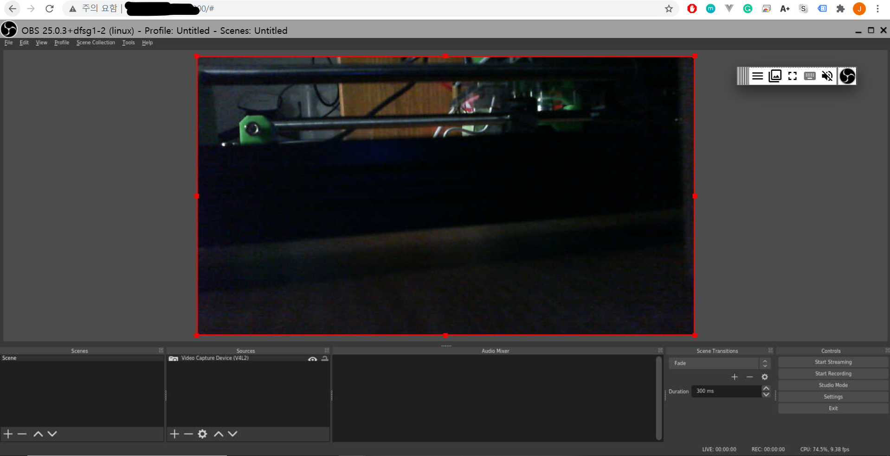

# obs-xpra-docker

OBS Studio on Xpra

# Usage

```bash
$ docker build --tag=obs-xpra .
$ docker run \
	--rm \
	--device /dev/video0 \
	-p 14500:14500 \
	-v /your-persistent-directory:/root \ # optional
	obs-xpra
```



# License

Apache License 2.0

